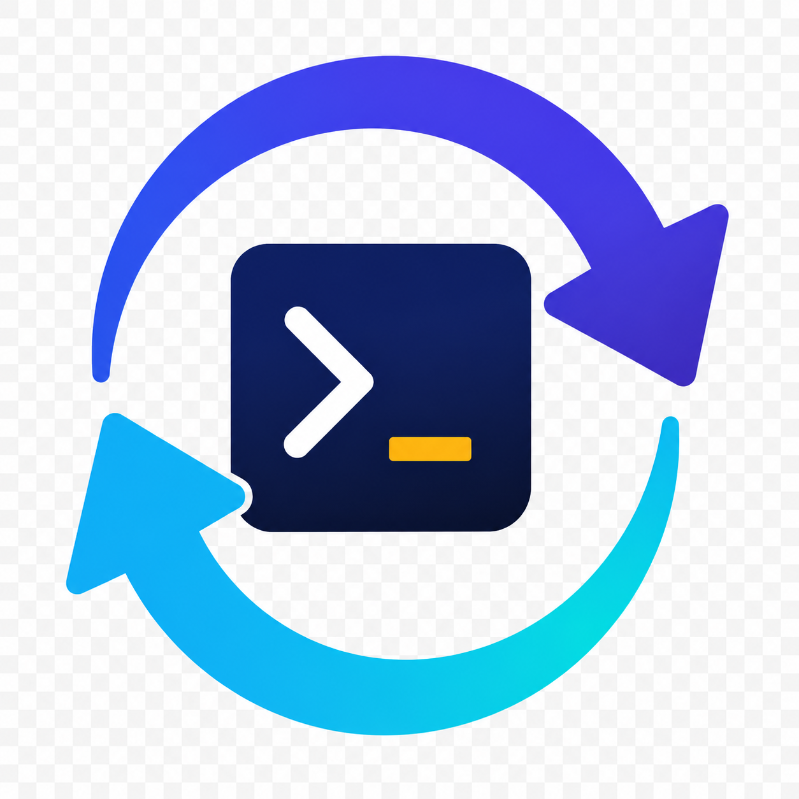

# Repo Terminal Switcher



A Windows-focused VS Code extension that adds a single-click **Repository
Terminals** list directly inside the Source Control view.

## Features

- Adds a single-click repository list inside Source Control.
- Replaces all existing integrated terminals with one fresh **Repo Terminal**
  in the selected repository's root.
- Refreshes automatically as VS Code's built-in Git extension discovers or
  closes repositories.

### Video walkthrough

The walkthrough video will be embedded here once its final recording is
available. It will show opening Source Control, clicking a repository once in
**Repository Terminals**, and seeing the terminal open at that repository's
root.

## Use

1. Open VS Code's Source Control view.
2. Expand **Repository Terminals**.
3. Click a repository name.

That one click closes every existing integrated terminal and creates one fresh
PowerShell terminal named **Repo Terminal** at the selected repository root.
The extension does not switch terminals when editor tabs or files change.

The list uses repositories discovered by VS Code's built-in Git extension and
refreshes when repositories open or close. If Git has not discovered any
repositories yet, workspace folders are shown as a fallback.

VS Code does not expose an extension event for clicking a repository name in
Microsoft's native **Repositories** list. The extension-owned **Repository
Terminals** list provides the one-click terminal switch with the supported API.

## Install

Download the newest `repo-terminal-switcher-*.vsix` file from
[Releases](https://github.com/mrjohndowe/repo-terminal-switcher/releases), then:

1. Open VS Code's Extensions view.
2. Open the `...` menu and choose **Install from VSIX...**.
3. Select the downloaded VSIX.
4. Run **Developer: Reload Window** from the Command Palette.

The extension checks this repository's public GitHub Releases after startup.
When a newer semantic version is available, it downloads and installs that
release automatically and offers to reload VS Code. Disable this with the
`repoTerminalSwitcher.autoUpdate` setting if desired.

## Publish an update

1. Change the `version` in `package.json` and update `CHANGELOG.md`.
2. Commit the changes.
3. Create and push a tag matching that version, such as `v1.2.0`.

The GitHub Actions workflow packages the extension and creates a public GitHub
Release with the VSIX attached. Existing installations discover it on their
next VS Code startup.

## Development

```powershell
pnpm install
pnpm run package

```
